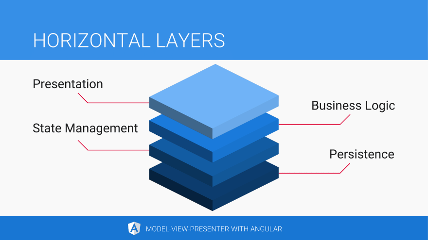

# Angular MVP 模式

引用：

- [Model-View-Presenter with Angular](https://dev.to/this-is-angular/model-view-presenter-with-angular-533h)
- [【译文】【前端架构鉴赏 03】：Angular 与 MVP 模式](https://zhuanlan.zhihu.com/p/159478723)

随着应用程序的日趋庞大，它变得越来越难以维护。随着可复用模块的重要性逐渐递增应用的复杂性也随之增长。我们都意识到我们应该在它面临难以维护的风险之前做些什么

设计模式能够拯救它！

## 分离关注点

- Presenter: 展示层
- Business Logic: 业务逻辑层
- State Management: 状态管理层
- Persistence: 数据持久化层

## MVP（Model-View-Presenter）模式

MVP 是一类实现程序界面的软件架构设计模式。借助它能使得类，函数，和难以测试的模块（软件部件）的复杂逻辑减到最小。特别是能使得类似于 Angular 组件的软件部件避免变得复杂。

像 MVC 模式一样，MVP 将模型（model）和表现（presentation）进行分离。表现层通过观察者模式（Observer Pattern）对数据的变化做出响应

在观察者模式（Observer Pattern）中，一个对象（subject）维护了一个当状态改变时需要通知的观察者（observers）列表。RxJS 就是基于观察者模式

视图（view）除了负责数据绑定以及把一些组件组合起来以外，它并不包含任何的逻辑或者行为。当用户交互发生时它把控制权委托给 presenter

presenter 会批处理状态的修改，所以当用户填写表单时最终呈现的是一个大型变更而不是许多零碎的修改，比如只能通过每一个表单的提交来更新应用的状态而不是每一个字段。这使得撤销或者重放状态的变更变得容易。presenter 通过命令更新状态。多亏了 Observer Synchronization 机制状态的改变才得以反馈到视图上
