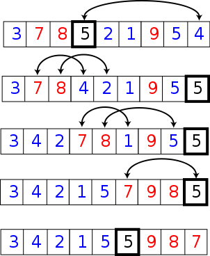

# 经典排序算法

[toc]

## 简单排序

### 选择排序

基本思想为每一趟从待排序的数据元素中选择最小（或最大）的一个元素作为首元素，直到所有元素排完为止。

```c
void select_sort(int arr[], int length) {
    for (int i = 0; i < length; i++) {
        int min_index = i;

        for (int j = i + 1; j < length; j++) {
            if (arr[j] < arr[min_index]) {
                min_index = j;
            }
        }

        if (min_index != i) {
            // swap
            int tmp = arr[i];
            arr[i] = arr[min_index];
            arr[min_index] = tmp;
        }
    }
}
```

时间复杂度 $O(n^2)$
**不稳定排序**

> 稳定排序：相同大小的元素之间的相对位置不会发生改变
> 比如待排序的序列：$[2_{(1)}, 4, 1, 2_{(2)}, 3]$
> 稳定升序排序之后：$[1, 2_{(1)}, 2_{(2)}, 3, 4]$

### 冒泡排序

基本思想是，对相邻的元素进行两两比较，顺序相反则进行交换，这样，每一趟会将最小或最大的元素“浮”到顶端，最终达到完全有序。


```c
void bubble_sort(int arr[], int length) {
    for (int i = 0; i < length - 1; i++) {
        // flag 在下面循环结束之后仍然为 1，说明序列已有序
        int flag = 1;
        for (int j = 0; j < length - 1 - i; j++) {
            if (arr[j] > arr[j + 1]) {
                swap(arr, j, j + 1);
                flag = 0;
            }
        }

        if (flag) {
            break;
        }
    }
}
```

时间复杂度 $O(n^2)$
**稳定排序**

## 分治法

字面上的解释是“分而治之”

1. 原问题分解为两个或多个相似子问题
2. 拆分直到子问题可以简单直接求解
3. 原问题的解即子问题的解的合并

快速排序、归并排序

## 归并排序

1. 将一个待排序序列从中心位置拆分成两个待排序序列
2. 直到将序列拆分成只有一个元素，此时解就已经求好
3. 两个有序序列合并为一个，原序列也是有序的了


复杂度分析：

1. 分。一个序列从中心位置拆分成两个序列，$O(1)$
2. 治。两个有序序列合并成一个有序序列，$O(n_1+n_2)$
   > $n_1$ 和 $n_2$ 分别代表两个序列的大小
   > [leetcode 寻找两个正序数组的中位数](https://leetcode-cn.com/problems/median-of-two-sorted-arrays/)
3. 递归复杂度 $O(log(n))$

时间复杂度计算：$O(log(n)) * [O(1) + O(n)] ≈ O(nlog(n))$

```c
#define MAX_LEN 10000
int reg[MAX_LEN];

void merge(int arr[], int left, int mid, int right) {
    int left1 = left, right1 = mid;
    int left2 = mid + 1, right2 = right;
    int i = left;

    while (left1 <= right1 && left2 <= right2) {
        reg[i++] = arr[left1] < arr[left2] ? arr[left1++] : arr[left2++];
    }
    while (left1 <= right1) {
        reg[i++] = arr[left1++];
    }
    while (left2 <= right2) {
        reg[i++] = arr[left2++];
    }
    for (i = left; i <= right; i++) {
        arr[i] = reg[i];
    }
}

void merge_sort(int arr[], int left, int right) {
    if (left < right) {
        int mid = (left + right) / 2;
        merge_sort(arr, left, mid);
        merge_sort(arr, mid + 1, right);
        merge(arr, left, mid, right);
    }
}
```

时间复杂度 $O(nlog(n))$
空间复杂度 $O(n)$
**稳定排序**

## 快速排序

一种改进的冒泡排序。冒泡排序的缺陷：每两个元素之间可能会进行多次比较。例如：
有一个序列：`[B, A, C]`，其中 `A < B < C`

- 第一轮冒泡
  先比较 `B` 和 `A`：`B > A`，交换，得到 `[A, B, C]`
  再比较 `B` 和 `C`：`B < C`，不交换，得到 `[A, B, C]`
  最大值 `C` 完成冒泡，剩下序列 `[A, B]`
- 第二轮冒泡
  比较 `A` 和 `B`：`A < B`，得到 `[A, B]`。排序完成

即使之前比较了 `A` 和 `B`，但是在下一轮冒泡时我们并不知道这两个元素之间的大小关系。造成了重复比较

1. 从序列中选取一个基准值，小于或等于基准值的放在基准值的左侧，大于基准值的放在基准值的右侧了，得到两个序列
2. 直到将序列拆分成只有一个元素，此时解就已经求好
3. 两个序列直接合并，就是有序的了



复杂度分析：

1. 分。基准值需要与每个元素判断， $O(n)$
2. 治。不需要额外操作，$O(1)$
3. 递归复杂度 $O(log(n))$

时间复杂度计算：$O(log(n)) * [O(n) + O(1)] ≈ O(nlog(n))$

```c
int partition(int arr[], int left, int right, int pivotIndex) {
    int pivotValue = arr[pivotIndex];
    swap(arr, pivotIndex, right); // 把pivot移到结尾
    int storeIndex = left;
    for (int i = left; i <= right - 1; i++) {
        if (arr[i] <= pivotValue) {
            swap(arr, storeIndex, i);
            storeIndex += 1;
        }
    }
    swap(arr, right, storeIndex); // 把pivot移到它最后的地方
    return storeIndex;
}

void quick_sort(int arr[], int left, int right) {
    if (left < right) {
        // 最方便的就是选择最后一个元素当作基准值
        int pivotIndex = right;
        int pivotNewIndex = partition(arr, left, right, pivotIndex);
        quick_sort(arr, left, pivotNewIndex - 1);
        quick_sort(arr, pivotNewIndex + 1, right);
    }
}
```

时间复杂度 $O(nlog(n))$，最坏情况是 $O(n^2)$
空间复杂度 $O(log(n))$，递归 $log(n)$ 次，需要栈空间
**不稳定排序**

## 小结

虽然是介绍排序算法，但更多的是讲解分治策略。快速排序和归并排序都是分治策列的体现，快排主要体现在分，归并主要体现在治
